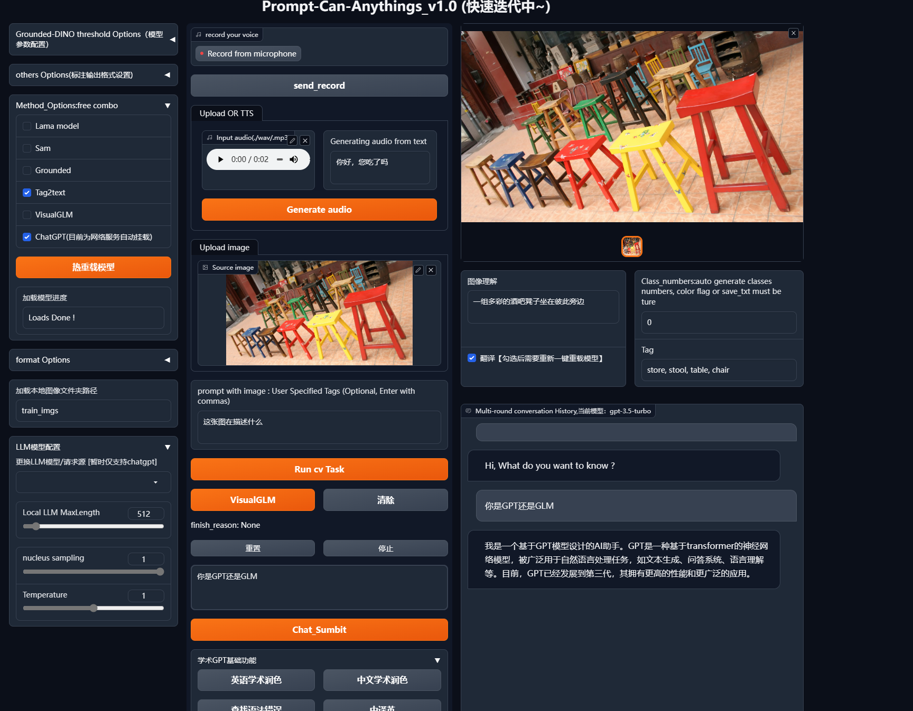

# Prompt-Can-Anything

<p align="center"> English | <a href="README_zh.md">中文</a></p>

This is a gradio  library and research repository that combines SOTA AI applications. It can help you achieve anything - all you need to do is provide prompts and make one click. Through the prompts and creativity of SOTA models, you can do anything.

**Motivation**

Currently, the “Annisson” AI intelligent agent backend has been accumulated for engineering and research. This requires the use of more multi-modal tasks and zero-shot models, not only to provide multi-modal AI processing web UI, but also to gradually enrich its functionality.

You can accomplish anything through this project! Let’s learn more about the development progress and plan of this project, and the final complete intelligent agent that combines the local GPT repository can help you call any AI task! Questions, stars, forks,You can also become a developer.

## Feature

 1. (YOCO) It is not just a tool that can prompt anything

    🔥 Data Engine:
    
    In addition, we will introduce video, audio, and 3D annotations in the future. YOCO relies on integrated multimodal models and auxiliary generators such as ChatGPT. Of course, it is not omnipotent. Through effective fully automatic annotation and stable diffusion series methods to produce and control data that meet the requirements, we complete the “data engine” and generate customized label formats that facilitate the training of conventional models.
    
    🔥 Model Training:
    
    For each model, we not only need to use it, but also read its paper, fine-tuning methods, and communicate with the original author to try some development work for improvement and better training. We use fine-tune large models and customized label formats generated by YOCO to more efficiently train conventional models.


2. 🚀 Interactive content creation and visual GPT

Integrate diversified GPT, mainly using the port of chatgpt, and use the open-source Tsinghua VISUALGLM to deploy and fine-tune localized GPT, as well as try to improve the model structure. Through multimodal application tools, we can conduct dialogues and content creation.

3. ⭐ 3D && 2D Avatar(comming soon)

Complete a role design interaction through a 3D Engine combined with multimodal tasks such as GPT;

Complete a role design interaction through the Saldtalker open source project and multimodal tasks such as GPT.

4. 🔥🔥🚀 Unlimited potential “Anything”

Through continuous creativity and accumulation, we will integrate and learn from SOTA AI. We will record each integrated model and provide a detailed explanation and summary in the article. The author will summarize all the AI-related knowledge reserves and engineering experience for the local large model (this part is the final development function and is planned).


<details open >
<summary>⭐ Research🚀 project🔥 Inspiration（In preparation）</summary>

	  At research level, Zero-shot comparative learning is research trend, we hope to understand as much as possible the model design details of the project we are applying, so that we want to combine text, images, and audio to design a strong aligned backbone.
	  At project level, Tensorrt acceleration of the basic model accelerates efficiency.


</details>

### <div align="left"> 🔥 [Update notice, frequent updates, Welcome fork] </div>

- One-click fine-tuning button function, adding: visualglm
- Voice text processing link GPT, joining chatglm
- Official latest model integration test for Tag2text version 2 in early June
- Generating class models will be added and tested in the near future
- One-click fine-tuning button function, adding: SAM

### <div align="left">⭐[News list] </div>
	-【2023/5/23】  add web demo:Add VisualGLM ,chatgpt from [Academic-gpt](https://github.com/binary-husky/gpt_academic)
	-【2023/5/7】   add web demo:At present, the function of text generation, detection and segmentation of images or image folders on the website has been tested normally, and the program does not need to be restarted, and the last model loading configuration is remembered, and it will be continuously optimized in the future.
	-【2023/5/4】   add  semantic segmentatio label, add args(--color-flag --save-mask )
	-【2023/4/26】  YOCO,Automatic annotation TOOLS:Commit preliminary code ,For the input image or folder, you can obtain the results of detection, segmentation, and text annotation , optional chatgpt api.


## Preliminary-Works

- [VisualGLM-6B](https://github.com/THUDM/VisualGLM-6B) : Visual ChatGlm. 

- [Segment Anything](https://github.com/facebookresearch/segment-anything) : Strong segmentation model. But it needs prompts (like boxes/points) to generate masks. 

- [Grounding DINO](https://github.com/IDEA-Research/GroundingDINO) :  Strong zero-shot detector which is capable of to generate high quality boxes and labels with free-form text. 

- [Stable-Diffusion](https://github.com/CompVis/stable-diffusion) :  Amazing strong text-to-image diffusion model.

- [Tag2text](https://github.com/xinyu1205/Tag2Text) : Efficient and controllable vision-language model which can simultaneously output superior image captioning and image tagging.
  
- [lama](https://github.com/advimman/lama) :  Resolution-robust large mask Inpainting with Fourier Convolutions

  
  
  ## :hammer_and_wrench: YOCO: Quick Start

First, Make sure you have a basic gpu deep learning environment.

 (Linux is recommended, Windows may have problems compiling Grounded-DINO Deformable- transformer operator, see [Grounding DINO](https://github.com/IDEA-Research/GroundingDINO) )

```bash
gir clone https://github.com/positive666/Prompt-Can-Anything
cd Prompt-Can-Anything
```

**Install environment:**

```bash
pip install -e .
```
Install VisualGLM（Optional, Recommond Linux）

```bash
git submodule update --init --recursive
cd  VisualGLM_6B && pip install -i https://mirrors.aliyun.com/pypi/simple/ -r requirements.txt
```

Install diffusers（Optional）

```bash
pip install --upgrade diffusers[torch]
```

#### Notice

For more content, you can check the requirements, “pip install < your missing packages>”, and if there are version installation issues, please check the version carefully in the requirements.

For PyAudio, it may not be successfully installed through pip on Linux platforms, so please go here [pyaudio-wheels · PyPI](https://pypi.org/project/pyaudio-wheels/#files), select the version that corresponds to your Python version, and install the WHL with pip after downloading. Additional details will be provided later.

**Run**	

1. downloads models weights

   <!-- insert a table -->

   <table>
     <thead>
       <tr style="text-align: left;">
         <th></th>
         <th>name</th>
          <th>backbone</th>
         <th>Data</th>
         <th>Checkpoint</th>
           <th>model-config</th>
       </tr>
     </thead>
     <tbody>
       <tr>
         <th>1</th>
         <td>Tag2Text-Swin</td>
         <td>Swin-Base</td>
         <td>COCO, VG, SBU, CC-3M, CC-12M</td>
         <td><a href="https://huggingface.co/spaces/xinyu1205/Tag2Text/blob/main/tag2text_swin_14m.pth">Download  link</a></td>
       <tr>
         <th>2</th>
         <td>Segment-anything</td>
          <td>vit</td>
           <td> </td>
           <td><a href="https://dl.fbaipublicfiles.com/segment_anything/sam_vit_h_4b8939.pth">Download  link</a>| <a 
   <td><a href="https://dl.fbaipublicfiles.com/segment_anything/sam_vit_l_0b3195.pth">Download  link</a>| <a 
       <td><a href="https://dl.fbaipublicfiles.com/segment_anything/sam_vit_b_01ec64.pth">Download  link</a></td>
       <tr>
         <th>3</th>
         <td>Lama</td>
           <td>FFC</td>
            <td> </td>
         <td><a href="https://disk.yandex.ru/d/ouP6l8VJ0HpMZg">Download  link</a></td>
       <tr>
         <th>4</th>
         <td>GroundingDINO-T</td>
         <td>Swin-T</td>
         <td>O365,GoldG,Cap4M</td>
         <td><a href="https://github.com/IDEA-Research/GroundingDINO/releases/download/v0.1.0-alpha/groundingdino_swint_ogc.pth">Github link</a> | <a href="https://huggingface.co/ShilongLiu/GroundingDINO/resolve/main/groundingdino_swint_ogc.pth">HF link</a></td>
         <td><a href="https://github.com/IDEA-Research/GroundingDINO/blob/main/groundingdino/config/GroundingDINO_SwinT_OGC.py">link</a></td>
       </tr>
       <tr>
         <th>5</th>
         <td>GroundingDINO-B</td>
         <td>Swin-B</td>
         <td>COCO,O365,GoldG,Cap4M,OpenImage,ODinW-35,RefCOCO</td>
         <td><a href="https://github.com/IDEA-Research/GroundingDINO/releases/download/v0.1.0-alpha2/groundingdino_swinb_cogcoor.pth">Github link</a>  | <a href="https://huggingface.co/ShilongLiu/GroundingDINO/resolve/main/groundingdino_swinb_cogcoor.pth">HF link</a> 
         <td><a href="https://github.com/IDEA-Research/GroundingDINO/blob/main/groundingdino/config/GroundingDINO_SwinB.cfg.py">link</a></td>
       </tr>
     </tbody>
   </table>
   

   

2. Configure privacy files and parameters in config_private.py. After downloading the model, configure the path in the “MODEL_xxxx_PATH” variable. If using ChatGPT, configure its proxy and API key. (If there are networking issues with other services such as TTS during use on the web UI, first turn off the VPN connection and only open it when using ChatGPT).

**🏃Demo**

1. Auto-label

```bash
"--input_prompt" :  You can manually input a prompt. For example, if you only want to detect target categories that interest you, you can directly input the prompt to the grounded detection model, or input it to the Tag2Text model.
'--color-flag': Using BOX’s tags, distinguish between category and instance segmentation: the category color of speech segmentation is distinguished using BOX’s tags.
```


   	python auto_lable_demo.py  --source <data path>  --save-txt  --save-mask --save-xml  --save_caption 

   Example:

​    Support multi-tasks, such as :

​                 default tasks include images understand /detect/instance segment .....(add methods for image generation and inpainting )


"Prompt" control models output, example

​					


2.   webui

```pyhton
		python app.py
```


​			




## 🔨To Do List

- [x] Release demo and code.
- [x] web ui  demo 
- [x] Support ChatGPT/VISUALGLM/ASR/TTS
- [ ]   YOCO labeling fine-tuning of VISUALGLM demo[next week]
- [ ] 3D && 2D avatar [next week]
- [ ] Complete the planned AI combination “Annison”
- [ ] Fine-tune the segmentation and ground detectors of SAM, and expand the input control of SAM
- [ ] Release training methods
- [ ] Knowledge cloning

## :cupid: Acknowledgements

- [Segment Anything](https://github.com/facebookresearch/segment-anything)
- [Grounding DINO](https://github.com/IDEA-Research/GroundingDINO)
- [Tag2text](https://github.com/xinyu1205/Tag2Text) 
- [lama](https://github.com/advimman/lama) 
- [ VisualGLM-6B](https://github.com/THUDM/VisualGLM-6B.git)

   Thanks for their great work!

