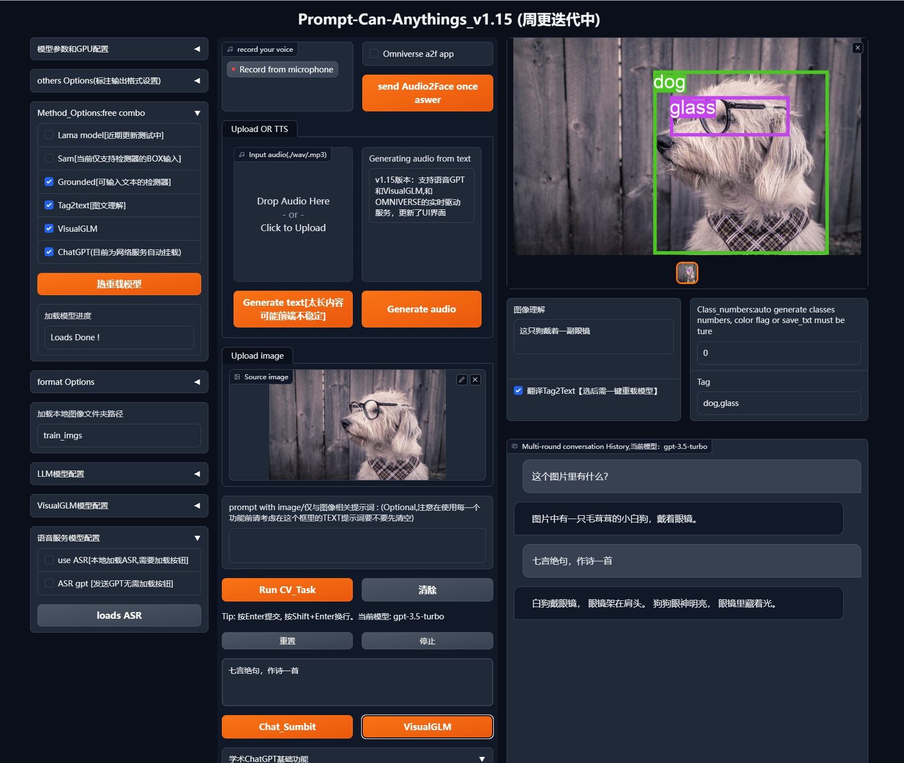
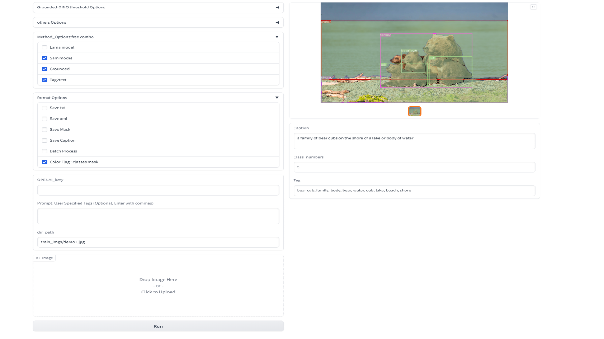

# Prompt-Can-Anything

<p align="center"> English | <a href="README_zh.md">中文</a></p>

This is a gradio  library and research repository that combines SOTA AI applications. It can help you achieve anything - all you need to do is provide prompts and make one click. Through the prompts and creativity of SOTA models, you can do anything.

**Motivation**

Currently, the “Anything” AI intelligent agent backend has been accumulated for engineering and research. This requires the use of more multi-modal tasks and zero-shot models, not only to provide multi-modal AI processing web UI, but also to gradually enrich its functionality.

You can accomplish anything through this project! Let’s learn more about the development progress and plan of this project, and the final complete intelligent agent that combines the local GPT repository can help you call any AI task! Questions, stars, forks,You can also become a developer.

## Feature

 1. (YOCO) It is not just a tool that can prompt anything

    🔥 Data Engine:
    
    In addition, we will introduce video, audio, and 3D annotations in the future. YOCO relies on integrated multimodal models and auxiliary generators such as ChatGPT. Of course, it is not omnipotent. Through effective fully automatic annotation and stable diffusion series methods to produce and control data that meet the requirements, we complete the “data engine” and generate customized label formats that facilitate the training of conventional models.
    
    🔥 Model Training:
    
    For each model, we not only need to use it, but also read its paper, fine-tuning methods, and communicate with the original author to try some development work for improvement and better training. We use fine-tune large models and customized label formats generated by YOCO to more efficiently train conventional models.


 2.  🚀 Interactive content creation and visual GPT

Integrate diversified GPT, mainly using the port of chatgpt, and use the open-source Tsinghua VISUALGLM to deploy and fine-tune localized GPT, as well as try to improve the model structure. Through multimodal application tools, we can conduct dialogues and content creation.

easy example( asr->llM_model->tts->a2f app)

https://github.com/positive666/Prompt-Can-Anything/assets/28972473/c9cc64af-939d-480f-a684-08d8db34b25f

 3. ⭐ 3D && 2D Avatar(comming soon)

Complete a role design interaction through a 3D Engine combined with multimodal tasks such as GPT;

Complete a role design interaction through the Sadtalker open source project and multimodal tasks such as GPT.


 4.  🔥🔥🚀 Unlimited potential “Anything”

Through continuous creativity and accumulation, we will integrate and learn from Sota AI. We will record each integrated model and provide a detailed explanation and summary in the article. The author will summarize all the AI-related knowledge reserves and engineering experience for the local large model (this part is the final development function and is planned).




<details open >
<summary>⭐ Research🚀 project🔥 Inspiration（In preparation）</summary>

	  At research level, Zero-shot comparative learning is research trend, we hope to understand as much as possible the model design details of the project we are applying, so that we want to combine text, images, and audio to design a strong aligned backbone.
	  At project level, Tensorrt acceleration of the basic model accelerates efficiency.


</details>

### <div align="left"> 🔥 [August , Update plan preview , Welcome fork] </div>

- 🔥 v1.2  coming soon(因为个人变更工作原因，目前更新较慢，目前语音实时并发已经基本优化好了)

-  Optimization of speech problems and code logic optimization before optimization, add Gilgen

- 🔥Official latest model integration test for Tag2text version 2 in early June,add RAM(Done)

- One-click fine-tuning button function, adding: visualglm  (Done)

-  Voice text processing link GPT, joining chatglm   with a2f APP( Done)

  

  

### <div align="left">⭐[News list] </div>
	-【2023/7/21】  update tag2text and ram with offical repo
	-【2023/6/7】   v1.15:add submodule SadTalker,update UI
	-【2023/6/6】   v1.15:environment installation problems and supplementary instructions, special models are called independently, and no need to install dependencies; Added the function of one-click fine-tuning of VisualGLM, considering machine configuration and video memory with caution
	-【2023/6/5】   v1.15 a vide demo and plan,fix asr bug ,chatgpt with asr and tts 
	-【2023/5/31】  Fixed the already issue, add tts demo, the Linux platform is tested through all open features
	-【2023/5/23】  add web demo:Add VisualGLM ,chatgpt from [Academic-gpt](https://github.com/binary-husky/gpt_academic)
	-【2023/5/7】   add web demo:At present, the function of text generation, detection and segmentation of images or image folders on the website has been tested normally, and the program does not need to be restarted, and the last model loading configuration is remembered, and it will be continuously optimized in the future.
	-【2023/5/4】   add  semantic segmentatio label, add args(--color-flag --save-mask )
	-【2023/4/26】  YOCO,Automatic annotation TOOLS:Commit preliminary code ,For the input image or folder, you can obtain the results of detection, segmentation, and text annotation , optional chatgpt api.


## Preliminary-Works

- [VisualGLM-6B](https://github.com/THUDM/VisualGLM-6B) : Visual ChatGlm(6B) 

- [Segment Anything](https://github.com/facebookresearch/segment-anything) : Strong segmentation model. But it needs prompts (like boxes/points/text) to generate masks. 

- [Grounding DINO](https://github.com/IDEA-Research/GroundingDINO) :  Strong zero-shot detector which is capable of to generate high quality boxes and labels with free-form text. 

- [Stable-Diffusion](https://github.com/CompVis/stable-diffusion) :  Amazing strong text-to-image diffusion model.

- [Tag2text](https://github.com/xinyu1205/Tag2Text) : Efficient and controllable vision-language model which can simultaneously output superior image captioning and image tagging.
- [SadTalker](https://github.com/OpenTalker/SadTalker): Learning Realistic 3D Motion Coefficients for Stylized Audio-Driven Single Image Talking Face Animation
- [lama](https://github.com/advimman/lama) :  Resolution-robust large mask Inpainting with Fourier Convolutions

  
  
  ## :hammer_and_wrench: YOCO: Quick Start

First, Make sure you have a basic gpu deep learning environment.

 (Linux is recommended, Windows may have problems compiling Grounded-DINO Deformable- transformer operator, see [Grounding DINO](https://github.com/IDEA-Research/GroundingDINO) )

```bash
git clone https://github.com/positive666/Prompt-Can-Anything
cd Prompt-Can-Anything
```

**Install environment **

Installation of basic environment

```
pip install -r requiremens  
or  
pip install -i https://mirrors.aliyun.com/pypi/simple/ -r requirements.txt
```

Installation of Ground detector (compiling)

```bash
cd model_cards
python setup.py install
```

Installation of Tsinghua VisualGLM (optional, better to use LINUX system, installation plan will be updated after testing on Windows)

```bash
git submodule update --init --recursive
cd VisualGLM_6B && pip install -i https://mirrors.aliyun.com/pypi/simple/ -r requirements.txt
```

Install SadTalker (optional )

```bash
git clone https://github.com/Winfredy/SadTalker.git
cd  SadTalker && pip install -i https://mirrors.aliyun.com/pypi/simple/ -r requirements.txt
```

​		Tips:create two directories, checkpoints and gfpgan, and place them in the root directory. Download the extracted weights from the official website and put them into two folders,

Installation of LAMA model (optional, not yet released):

This environment has a relatively strict requirement for the Python version, you may need to manually override the installation by version specified in the txt below:

```
pip install -r model_cards/lama/requirements.txt
```

Installation of diffuser (optional):

```bash
pip install --upgrade diffusers[torch]
```

For more content, you can check requirements, “pip install < your missing packages>”, if there is an installation version issue, please carefully look at the requirement version.

**Linux environment issue**:

1. for pyaudio

Method 1:

 pip may not be successful on the Linux platform, go to this page[pyaudio-wheels · PyPI](https://pypi.org/project/pyaudio-wheels/#files), select the version corresponding to your Python version, download it and pip install the whl file. Detailed instructions will be provided in the future.

Method 2:

```
sudo apt-get install portaudio19-dev
sudo apt-get install python3-all-dev
pip install pyaudio
```

2. use qlora fine tune question

   ```
   pip install  bitsandbytes  -i https://mirrors.aliyun.com/pypi/simple
   ```

**Windows installation issue**

​			to be resolved and sorted out.Notice

For more content, you can check the requirements, “pip install < your missing packages>”, and if there are version installation issues, please check the version carefully in the requirements.


**Run**	

1. downloads models weights

   <!-- insert a table -->

   <table>
     <thead>
       <tr style="text-align: left;">
         <th></th>
         <th>name</th>
          <th>backbone</th>
         <th>Data</th>
         <th>Checkpoint</th>
           <th>model-config</th>
       </tr>
     </thead>
     <tbody>
       <tr>
         <th>1</th>
         <td>Tag2Text-Swin</td>
         <td>Swin-Base</td>
         <td>COCO, VG, SBU, CC-3M, CC-12M</td>
         <td><a href="https://huggingface.co/spaces/xinyu1205/Tag2Text/blob/main/tag2text_swin_14m.pth">Download  link</a></td>
       <tr>
         <th>2</th>
         <td>Segment-anything</td>
          <td>vit</td>
           <td> </td>
           <td><a href="https://dl.fbaipublicfiles.com/segment_anything/sam_vit_h_4b8939.pth">Download  link</a>| <a 
   <td><a href="https://dl.fbaipublicfiles.com/segment_anything/sam_vit_l_0b3195.pth">Download  link</a>| <a 
       <td><a href="https://dl.fbaipublicfiles.com/segment_anything/sam_vit_b_01ec64.pth">Download  link</a></td>
       <tr>
         <th>3</th>
         <td>Lama</td>
           <td>FFC</td>
            <td> </td>
         <td><a href="https://disk.yandex.ru/d/ouP6l8VJ0HpMZg">Download  link</a></td>
       <tr>
         <th>4</th>
         <td>GroundingDINO-T</td>
         <td>Swin-T</td>
         <td>O365,GoldG,Cap4M</td>
         <td><a href="https://github.com/IDEA-Research/GroundingDINO/releases/download/v0.1.0-alpha/groundingdino_swint_ogc.pth">Github link</a> | <a href="https://huggingface.co/ShilongLiu/GroundingDINO/resolve/main/groundingdino_swint_ogc.pth">HF link</a></td>
         <td><a href="https://github.com/IDEA-Research/GroundingDINO/blob/main/groundingdino/config/GroundingDINO_SwinT_OGC.py">link</a></td>
       </tr>
       <tr>
         <th>5</th>
         <td>GroundingDINO-B</td>
         <td>Swin-B</td>
         <td>COCO,O365,GoldG,Cap4M,OpenImage,ODinW-35,RefCOCO</td>
         <td><a href="https://github.com/IDEA-Research/GroundingDINO/releases/download/v0.1.0-alpha2/groundingdino_swinb_cogcoor.pth">Github link</a>  | <a href="https://huggingface.co/ShilongLiu/GroundingDINO/resolve/main/groundingdino_swinb_cogcoor.pth">HF link</a> 
         <td><a href="https://github.com/IDEA-Research/GroundingDINO/blob/main/groundingdino/config/GroundingDINO_SwinB.cfg.py">link</a></td>
       </tr>
     </tbody>
   </table>
   

   

2. Configure privacy files and parameters in config_private.py. After downloading the model, configure the path in the “MODEL_xxxx_PATH” variable. If using ChatGPT, configure its proxy and API key. (If there are networking issues with other services such as TTS during use on the web UI, first turn off the VPN connection and only open it when using ChatGPT).

**🏃Demo**

 [Video demo 1 online on baidu clound ](https://pan.baidu.com/s/1AllUjuOVhzJh7abe71iCxg?pwd=c6v）   
 [ Video demo 2 ] (https://pan.baidu.com/s/1jdP9mgUhyfLh_hz1W3pkeQ?pwd=c6v6)


1. Auto-label

```bash
"--input_prompt" :  You can manually input a prompt. For example, if you only want to detect target categories that interest you, you can directly input the prompt to the grounded detection model, or input it to the Tag2Text model.
'--color-flag': Using BOX’s tags, distinguish between category and instance segmentation: the category color of speech segmentation is distinguished using BOX’s tags.
```


   	python auto_lable_demo.py  --source <data path>  --save-txt  --save-mask --save-xml  --save_caption 

   Example:

​    Support multi-tasks, such as :

​                 default tasks include images understand /detect/instance segment .....(add methods for image generation and inpainting )


"Prompt" control models output, example

​					


2.   webui(all)

```pyhton
		python app.py
```



​			


​	2.1 audio2face with llm model (Beta)

​			In Fact, ASR\TTS\LLM ，They are all arbitrarily replaceable.

​           this  is  a easy  example, support chatglm,chatgpt(you can use anything llm model,but you need custom )

​           start asr&tts with audio2face 

​			you need  install audio2face in omniverse APP,see

https://www.nvidia.cn/omniverse/

​			step1. In audio2face，open a demo ,choose a Player ,auto build Trt engine ,（not support GTX10xx GPU）


​	      step 2. in webui ,click"start system" and" Speech_system"

​																		 								


## 🔨To Do List

- [x] Release demo and code.
- [x] web ui  demo 
- [x] Support ChatGPT/VISUALGLM/ASR/TTS
- [x]   YOCO labeling fine-tuning of VISUALGLM demo[next week]
- [x] 3D && 2D avatar 
- [ ] Complete the planned AI combination “Annison”
- [ ] Fine-tune the segmentation and ground detectors of SAM, and expand the input control of SAM
- [ ] Release training methods
- [ ] Knowledge cloning

## :cupid: Acknowledgements

- [Segment Anything](https://github.com/facebookresearch/segment-anything)
- [Grounding DINO](https://github.com/IDEA-Research/GroundingDINO)
- [Tag2text](https://github.com/xinyu1205/Tag2Text) 
- [SadTalker](https://github.com/OpenTalker/SadTalker)
- [lama](https://github.com/advimman/lama) 
- [ VisualGLM-6B](https://github.com/THUDM/VisualGLM-6B.git)

   Thanks for their great work!

