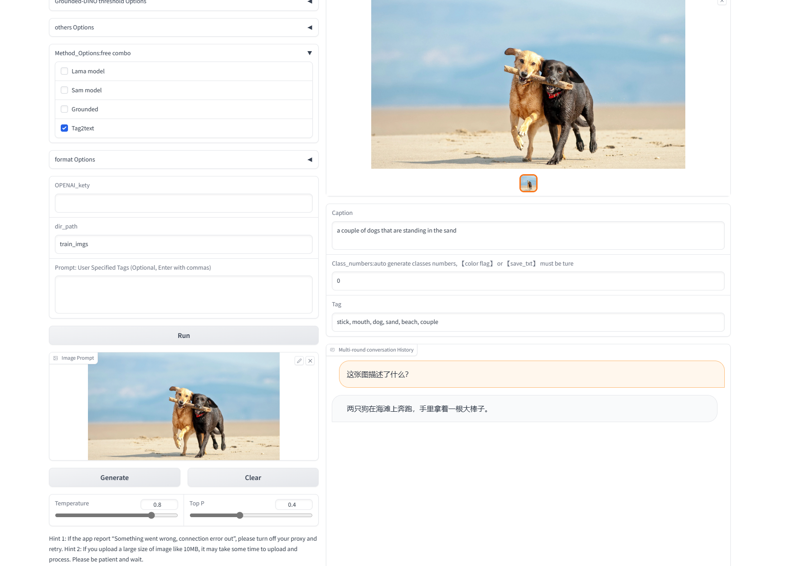

# Prompt-Can-Anything
一个完全自动化的工具箱：你只需要提供提示！只需一次点击！通过SOTA模型的提示和创意，你可以做任何事情。

**动机**

当前：为工程和研究创建数据引擎的完全自动化AI工具可能需要使用更多的CLIP以及zero-shot模型。

目标：计划生成高质量的数据标注数据并训练我们的模型。

所以它只是一个可以提示任何事情的工具（YOCO）

1. 全自动标注工具，当前结构（YOCO）

   此外，我们将在未来引入视频、音频和3D注释。


2. 半自动交互UI工具（计划推出）
2.  图像编辑和创作（近期更新）

## 特性

- 🔥 数据引擎

  提供完全自动的数据注释，并通过工程优化对其进行细化，通过稳定扩散和GPT的相关模型，我们可以为下游任务创建更多的数据源能力。

  可扩展的一键注释训练，用于三方项目的使用，例如Yolo、Lora模式。（即将推出）

- 🚀🚀内容创作和视觉GPT

   目前使用了chatgpt(需要配置代理，可能在CONDA环境里也要修改端口号)	，加入了清华开源的VisualGLM

- 🔥希望它不只是一个工具或者插件，我们会整理各个模型的细致分析和微调改进方法。			

- 🚀加速视频和数据集的处理（即将推出）

<details open>
<summary>⭐ 研究 🚀 项目 🔥 灵感（筹备中）</summary>

在研究层面上，零样本迁移比较学习是热门的研究趋势，我希望尽可能理解正在应用的项目的模型设计细节，这样我们想将文本、图像和音频相结合设计一个强大的对齐backbone。

在项目层面上，Tensorrt加速基本模型或者其他的模型转换方式可以提高效率。

</details>

### <div align="left">⭐ [新闻列表]</div>

- 【2023/5/23】添加Web演示：加入清华的VisualGLM-6B版本

- 【2023/5/7】添加Web演示：目前，已经测试了文本生成、图像或图像文件夹的检测和分割功能，程序无需重新启动，记住了最后的模型加载配置，并将在未来持续优化。
- 【2023/5/4】添加语义分割标签，添加args（--color-flag --save-mask）
- 【2023/4/26】YOCO，自动标注工具：提交初步代码，针对输入图像或文件夹，可以获得检测、分割和文本注释的结果，额外提供选择chatgpt api。

**预备工作**

- [VisualGLM-6B](https://github.com/THUDM/VisualGLM-6B.git) : Visual ChatGlm. 

- [Segment Anything](https://github.com/facebookresearch/segment-anything)：强大的分割模型。但它需要提示（如盒子/点）来生成蒙版。

- [Grounding DINO](https://github.com/IDEA-Research/GroundingDINO)：强大的零样本泛化检测器，能够使用自由格式文本生成高质量框和标签。

- [Stable-Diffusion](https://github.com/CompVis/stable-diffusion)：文本-图像扩散模型。

- [Tag2text](https://github.com/xinyu1205/Tag2Text)：高效可控的视觉-语言模型，可以同时输出优越的图像字幕和图像标记。

- [lama](https://github.com/advimman/lama)：分辨率鲁棒的大屏蔽填充与傅立叶卷积

**:hammer_and_wrench: YOCO: 快速入门**

首先，需要有基本的gpu深度学习环境。

（建议使用Linux，Windows可能在编译Grounded-DINO Deformable和配置Visualglm时候算子时出现问题，参见[Grounding DINO](https://github.com/IDEA-Research/GroundingDINO)）

```bash
gir clone https://github.com/positive666/Prompt-Can-Anything
cd Prompt-Can-Anything
```

安装环境：

```bash
pip install -e .
```


安装扩散器（可选）：

```bash
pip install --upgrade diffusers[torch]
```

更多内容，可以查看requirements, “pip install < your missing packages>”。

运行

1. 下载模型权重

<!-- insert a table -->

<table>
  <thead>
    <tr style="text-align: left;">
      <th></th>
      <th>名称</th>
       <th>骨干</th>
      <th>数据</th>
      <th>权重</th>
        <th>模型配置</th>
    </tr>
  </thead>
  <tbody>
    <tr>
      <th>1</th>
      <td>Tag2Text-Swin</td>
      <td>Swin-Base</td>
      <td>COCO、VG、SBU、CC-3M、CC-12M</td>
      <td><a href="https://huggingface.co/spaces/xinyu1205/Tag2Text/blob/main/tag2text_swin_14m.pth">下载链接</a></td>
    <tr>
      <th>2</th>
      <td>Segment-anything</td>
       <td>vit</td>
        <td> </td>
        <td><a href="https://dl.fbaipublicfiles.com/segment_anything/sam_vit_h_4b8939.pth">下载链接</a>| <a 
    <td><a href="https://dl.fbaipublicfiles.com/segment_anything/sam_vit_l_0b3195.pth">下载链接</a>| <a 
    <td><a href="https://dl.fbaipublicfiles.com/segment_anything/sam_vit_b_01ec64.pth">下载链接</a></td>
    <tr>
      <th>3</th>
      <td>Lama</td>
        <td>FFC</td>
         <td> </td>
      <td><a href="https://disk.yandex.ru/d/ouP6l8VJ0HpMZg">下载链接</a></td>
    <tr>
      <th>4</th>
      <td>GroundingDINO-T</td>
      <td>Swin-T</td>
      <td>O365、GoldG、Cap4M</td>
      <td><a href="https://github.com/IDEA-Research/GroundingDINO/releases/download/v0.1.0-alpha/groundingdino_swint_ogc.pth">Github链接</a> | <a href="https://huggingface.co/ShilongLiu/GroundingDINO/resolve/main/groundingdino_swint_ogc.pth">HF链接</a></td>
      <td><a href="https://github.com/IDEA-Research/GroundingDINO/blob/main/groundingdino/config/GroundingDINO_SwinT_OGC.py">链接</a></td>
    </tr>
    <tr>
</table>
   2. 配置文件和参数在 utils/conf.py 下,下载模型后将路径配置在" MODEL_xxxx_PATH“的变量  ,如果使用 chatgpt,配置其代理和API密钥

      

**🏃Demo** 

1. without web-ui

      ```bash
   "--input_prompt" :  你可以手动输入prompt,比如你只想检测你感兴趣的目标类别，可以直接输入给grounded检测模型，也可以输入给tag2text
   '--color-flag': 使用BOX的标签同类别和实例分割区别:语音分割的类别颜色
   ```

   
   	python demo.py  --source <data path>  --save-txt  --save-mask --save-xml  --save_caption 
   
   


2. webui

```pyhton
		python app.py
```


3. webui with chatglm			

```
		python app.py --chat_glm --quant
```



**🔨计划清单**

- [x] Release demo and code(2 days within).
- [x] web ui   demo 
- [x] support video ,chatgpt, visualglm,add inpainting model demo
- [ ] add 3d nerf demo 
- [ ] fintune sam and ground 
- [ ] Release training datasets.


## 参考工作 

- [Segment Anything](https://github.com/facebookresearch/segment-anything)
- [Grounding DINO](https://github.com/IDEA-Research/GroundingDINO)
- [Tag2text](https://github.com/xinyu1205/Tag2Text) 
- [lama](https://github.com/advimman/lama) 
- [VisualGLM-6B](https://github.com/THUDM/VisualGLM-6B.git) 

感谢他们的出色工作！

