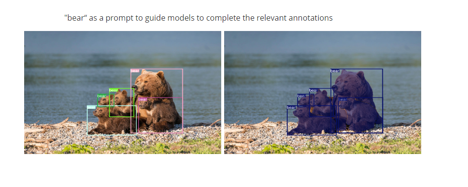
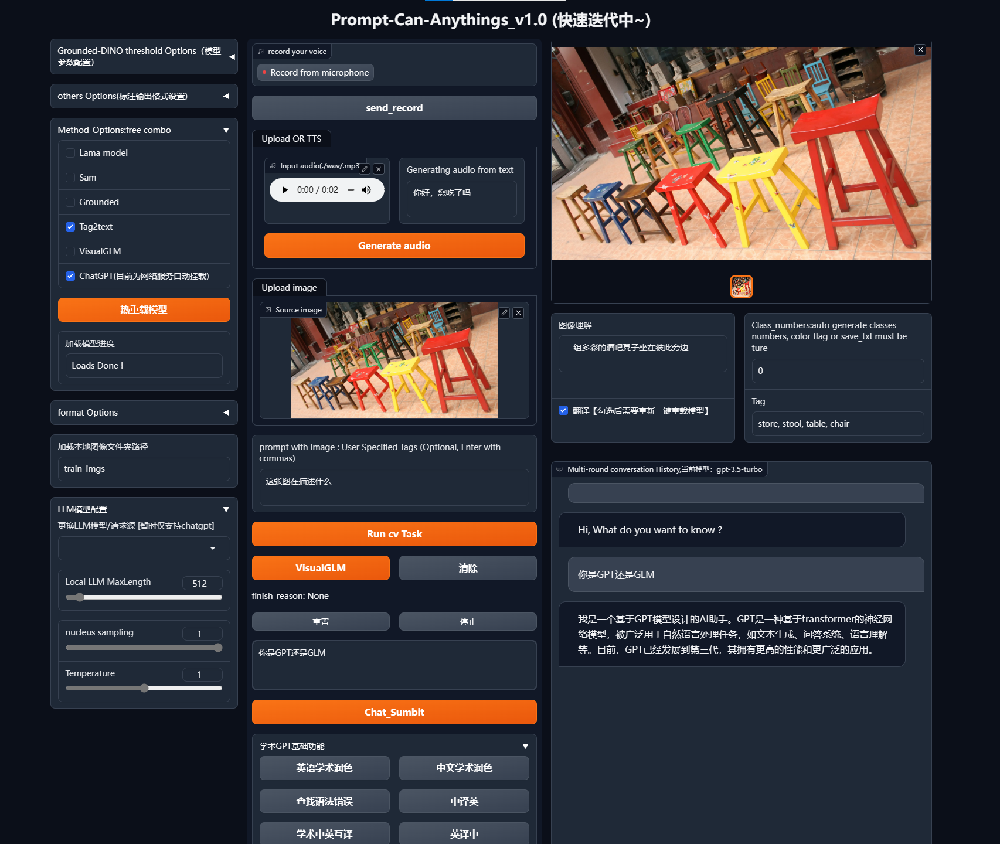

# Prompt-Can-Anything

这是一个结合SOTA AI的应用web库以及研究的储备库，它能够帮你实现一切：你只需要提供提示！只需一次点击！通过SOTA模型的提示和创意，你可以做任何事情。

**动机**

当前：为工程和研究所积累的AI智能体后台”安尼森“，这需要使用更多的多模态任务以及zero-shot模型，不仅提供多模态的AI处理web UI，逐渐丰富的功能。

目标：你可以通过它完成一切事情！让我们详细了解下该项目的开发进度和计划，最终完整的智能体结合本地储备的GPT可以帮你调用一切AI任务！欢迎提问、star和fork,以及伸出援助之手~

## 特性

1. （YOCO）它不仅是一个可以提示任何事情的工具

   🔥 数据引擎：
   
   此外，我们将在未来引入视频、音频和3D注释，YOCO依赖于集成的多模态模型以及GPT等辅助生成，当然它并不是万能的，通过有效的全自动标注和stable diffusion系列的方法去生产和控制符合需求的数据，完成”数据引擎“，并且生成的定制化的标签格式，去便于训练常规模型。
   
   🔥 模型训练: 
   
   对于每一个模型我们不仅要做到使用，还在阅读它的论文和微调方法以及和原作者交流，尝试一些改进和更好训练的开发工作，Fine-tune大模型和通过YOCO生成的定制化的标签格式，更高效地训练常规模型。
   
   


2. 🚀交互内容创作和视觉&&语音GPT

​      集成多样化GPT，目前主要以chatgpt的端口为主，利用开源的清华VISUALGLM，我们实现本地化GPT的部署和微调，以及尝试改进模型结构，通过多模态的应用工具进行对话和内容创作，支持语音识别、语音合成、并发送Audio2face.

​		这是一个最简单的例子

​		https://github.com/positive666/Prompt-Can-Anything/assets/28972473/c9cc64af-939d-480f-a684-08d8db34b25f


3. ⭐ 应用角色扮演—— 3D &&2D 虚拟人（开发中）

   通过3D引擎去结合GPT等多模态任务完成一个角色设计互动；

   通过saldtalker开源项目去结合GPT等多模态任务完成一个角色设计互动；

   

4.  🔥🔥🚀无限的潜力“安尼森”

​	   不断的创意和积累，SOTA -AI的集成和学习，我们会通过记录每一个集成的模型，对它进行一次详解，总结在文章中。

​	   作者AI相关所有知识储备和工程经验总结给本地大模型（这部分是最终开发功能，计划中）


<details open>
<summary>⭐ 研究 🚀 项目 🔥 灵感（筹备中）</summary>

在研究层面上，零样本迁移比较学习是热门的研究趋势，我希望尽可能理解正在应用的项目的模型设计细节，这样我们想将文本、图像和音频相结合设计一个强大的对齐backbone。

在项目层面上，可考虑Tensorrt加速基本模型或者其他的模型转换方式可以提高效率。

</details>

### <div align="left">🔥 [8月更新预告，更新频繁，感兴趣关注]</div>

-  更新了ram&7tag2Text【Done】

-  修复优化开源GLM的一些功能，一键微调按钮和各种微调模型

-  语音文本处理链接gpt，加入chatglm    【Done】

- Gilgen测试代码更新

- ram&7tag2TexT等解析文章

  


</details>

### <div align="left">⭐ [更新列表]</div>

-  【2023/7/21】 v1.15: 更新了Tag2text和ram的代码，支持RAM，是一个中英识别标签的双模态模型

-  【2023/6/7】 v1.15 :加入子项目SadTalker，更新UP界面，语音对话功能界面更新

-  【2023/6/6】 v1.15版本:修复了已知的环境安装问题和补充说明，特殊的模型独立了调用，不需要可以不用安装依赖了；添加了一键微调VisualGLM的功能，考虑机器配置和显存慎用；

-  【2023/6/5】 修复whisper asr的bug，内部可选模型，但是考虑显存不建议超过small,上传百度云一个介绍。

- 【2023/5/31】添加Web演示：修复已知问题BUG，添加TTS模块（临时版本），LINUX系统上测试通过了所有开放的功能，补充一些说明和测试。（修改重载：每次勾选加载模型和释放模型后，因为太多的本地化的大模型，如果部署本地GPT显卡必须要20G+，但目前机制无法动态释放调节释放多个模型显存，这个按钮只能帮助你选择、组合串联cv模型的使用方式了）

- 【2023/5/29】添加Web演示：加入了学术chatgpt部分功能，感谢他们的工作，其次添加了一键生成VisualGLM-6B数据集标注功能，后续可一键微调

- 【2023/5/23】添加Web演示：加入清华的VisualGLM-6B版本

- 【2023/5/7】添加Web演示：目前，已经测试了文本生成、图像或图像文件夹的检测和分割功能，程序无需重新启动，记住了最后的模型加载配置，并将在未来持续优化。
- 【2023/5/4】添加语义分割标签，添加args（--color-flag --save-mask）
- 【2023/4/26】YOCO，自动标注工具：提交初步代码，针对输入图像或文件夹，可以获得检测、分割和文本注释的结果，额外提供选择chatgpt api。

**预备工作**

- [VisualGLM-6B](https://github.com/THUDM/VisualGLM-6B.git) : Visual ChatGlm. 

- [Segment Anything](https://github.com/facebookresearch/segment-anything)：强大的分割模型。但它需要提示（如包围框/点/掩码、文本）来生成蒙版。

- [Grounding DINO](https://github.com/IDEA-Research/GroundingDINO)：强大的零样本泛化检测器，能够使用自由格式文本生成高质量框和标签。

- [Stable-Diffusion](https://github.com/CompVis/stable-diffusion)：文本-图像扩散模型。

- [Tag2text](https://github.com/xinyu1205/Tag2Text)：高效可控的视觉-语言模型，可以同时输出优越的图像字幕和图像标记。

- [SadTalker](https://github.com/OpenTalker/SadTalker):单图声音驱动人脸的方法

- [lama](https://github.com/advimman/lama)：分辨率鲁棒的大屏蔽填充与傅立叶卷积

  ## :hammer_and_wrench: YOCO: 快速入门

首先，需要有基本的gpu深度学习环境。

（强烈建议使用Linux，Windows可能在编译Grounded-DINO Deformable和配置Visualglm时候算子时出现问题，参见[Grounding DINO](https://github.com/IDEA-Research/GroundingDINO)）

```bash
git clone https://github.com/positive666/Prompt-Can-Anything
cd Prompt-Can-Anything
```

安装基本环境：

```
pip install -r requirements
或者
pip install -i https://mirrors.aliyun.com/pypi/simple/ -r requirements.txt
```

安装Ground检测器（编译）：

```
cd  model_cards
python setup.py install
```

安装清华视觉VisualGLM（可选，最好用LINUX系统，window后面测试后补充安装方案）：

```bash
git submodule update --init --recursive
cd  VisualGLM_6B && pip install -i https://mirrors.aliyun.com/pypi/simple/ -r requirements.txt
```

安装SadTalker(optional )

```bash
git clone https://github.com/Winfredy/SadTalker.git
cd  SadTalker && pip install -i https://mirrors.aliyun.com/pypi/simple/ -r requirements.txt
```

​			Tips:创建checkpoints 和gfpgan两个目录，放置在根目录下。从官网下载解压的权重分别放进两个文件夹!!

安装LAMA模型（可选还未发布）：

​    这个环境对Python版本要求比较苛刻，可能需要按照下面txt的版本手动覆盖安装

```
 pip install -r model_cards/lama/requirements.txt 
```

安装扩散器（可选）：

```bash
pip install --upgrade diffusers[torch]
```

更多内容，可以查看requirements, “pip install < your missing packages>”, 如果出现安装版本问题，请仔细看requirements的版本

**Linux环境问题【易出现问题的库】**

1. 对于pyaudio

方法一：在Linux平台可能通过pip并不一定成功，进入这里[pyaudio-wheels · PyPI](https://pypi.org/project/pyaudio-wheels/#files)，选择对应你Python的版本，下载后pip安装whl，后续会详细补充。

方法二：

```
sudo apt-get install portaudio19-dev
sudo apt-get install python3-all-dev
pip install pyaudio
```

2.VisualGLM训练环境:使用qlora微调int4模型问题：

```
pip install  bitsandbytes  -i https://mirrors.aliyun.com/pypi/simple
```

**Windows安装问题**

待解决整理

运行

1. 下载模型权重

<!-- insert a table -->

<table>
  <thead>
    <tr style="text-align: left;">
      <th></th>
      <th>名称</th>
       <th>骨干</th>
      <th>数据</th>
      <th>权重</th>
        <th>模型配置</th>
    </tr>
  </thead>
  <tbody>
    <tr>
      <th>1</th>
      <td>Tag2Text-Swin</td>
      <td>Swin-Base</td>
      <td>COCO、VG、SBU、CC-3M、CC-12M</td>
      <td><a href="https://huggingface.co/spaces/xinyu1205/Tag2Text/blob/main/tag2text_swin_14m.pth">下载链接</a></td>
    <tr>
      <th>2</th>
      <td>Segment-anything</td>
       <td>vit</td>
        <td> </td>
        <td><a href="https://dl.fbaipublicfiles.com/segment_anything/sam_vit_h_4b8939.pth">下载链接</a>| <a 
    <td><a href="https://dl.fbaipublicfiles.com/segment_anything/sam_vit_l_0b3195.pth">下载链接</a>| <a 
    <td><a href="https://dl.fbaipublicfiles.com/segment_anything/sam_vit_b_01ec64.pth">下载链接</a></td>
    <tr>
      <th>3</th>
      <td>Lama</td>
        <td>FFC</td>
         <td> </td>
      <td><a href="https://disk.yandex.ru/d/ouP6l8VJ0HpMZg">下载链接</a></td>
    <tr>
      <th>4</th>
      <td>GroundingDINO-T</td>
      <td>Swin-T</td>
      <td>O365、GoldG、Cap4M</td>
      <td><a href="https://github.com/IDEA-Research/GroundingDINO/releases/download/v0.1.0-alpha/groundingdino_swint_ogc.pth">Github链接</a> | <a href="https://huggingface.co/ShilongLiu/GroundingDINO/resolve/main/groundingdino_swint_ogc.pth">HF链接</a></td>
      <td><a href="https://github.com/IDEA-Research/GroundingDINO/blob/main/groundingdino/config/GroundingDINO_SwinT_OGC.py">链接</a></td>
    </tr>
    <tr>
</table>
   2. 配置隐私文件和参数在 config_private.py 下,下载模型后将路径配置在" MODEL_xxxx_PATH“的变量  ,如果使用 chatgpt ,配置其代理和API密钥，可能在WEBUI使用过程中，如果其他服务如tts有联网问题，先关掉VPN链接，仅当使用Chatgpt时候打开。

      

## 🏃Demo

 [视频Demo介绍 ](https://pan.baidu.com/s/1AllUjuOVhzJh7abe71iCxg?pwd=c6v）  
 [ Video demo 2 ] (https://pan.baidu.com/s/1jdP9mgUhyfLh_hz1W3pkeQ?pwd=c6v6)

1. 自动标注的测试样例

      ```bash
   "--input_prompt" :  你可以手动输入prompt,比如你只想检测你感兴趣的目标类别，可以直接输入给grounded检测模型，也可以输入给tag2text
   '--color-flag': 使用BOX的标签同类别和实例分割区别:语义分割的类别颜色
   ```

   支持多种任务，例如：
   
   默认任务包括图像理解/检测/实例分割…(以及后修添加图像生成和编辑的方法去制作新数据)
   
   
   
   "Prompt" control models output, example
   
   ​					
   
   
   	python auto_label_demo.py  --source <data path>  --save-txt  --save-mask --save-xml  --save_caption 
   
   


2. webui

   

   ```pyhton
   		python app.py
   ```

   

   

   

   ​			

   
   
   
   
   2.语音大语言模型&&驱动a2f 
   
   ​           这是一个简单的例子，实际上asr、tts\llm_model\这些组件是可以任意替换的，只要你具备基本的开发能力，通过语言模型和语音驱动去完成A2F的服务，你需要安装Omniverse软件和Audio2face的应用，GPU不能是比较旧的帕斯卡架构，详情可以看https://www.nvidia.cn/omniverse/
   
   ​			步骤1.在Omniverse中，点击如图下的例子，安装一个Demo player,它会自动完成tensortt的构建，然后可以如下图中获取Player的路径Prim Path
   
   
   
   
   
   ​											
   
   ​										  
   
   ​	     步骤2. 程序运行起来后，将上面获得的路径拷贝，填写在config_private的“Avatar_instance_A”，在web端如图下操作点击 ‘start system’后，点击加载“Speech_system”启动语音模式，但是注意TTS是网络服务。
   
   ​														   					   
   
   

## 🔨计划清单

- [x] 释放初版
- [x] web ui 界面调整 
- [x] 支持chatgpt/VISUALGLM/ASR/TTS
- [x] Yoco一键标注微调VISUALGLM Demo
- [x] 3d &&2d avatvor
- [ ] 完成计划的AI结合体“安尼森”
- [ ] 微调sam分割器 and ground检测器 ,拓展SAM的输入控制
- [ ] 释放训练方法.
- [ ] 知识克隆


## 参考工作 

- [Segment Anything](https://github.com/facebookresearch/segment-anything)
- [Grounding DINO](https://github.com/IDEA-Research/GroundingDINO)
- [Tag2text](https://github.com/xinyu1205/Tag2Text) 
- [SadTalker](https://github.com/OpenTalker/SadTalker)
- [lama](https://github.com/advimman/lama) 
- [VisualGLM-6B](https://github.com/THUDM/VisualGLM-6B.git) 

感谢他们的出色工作！

